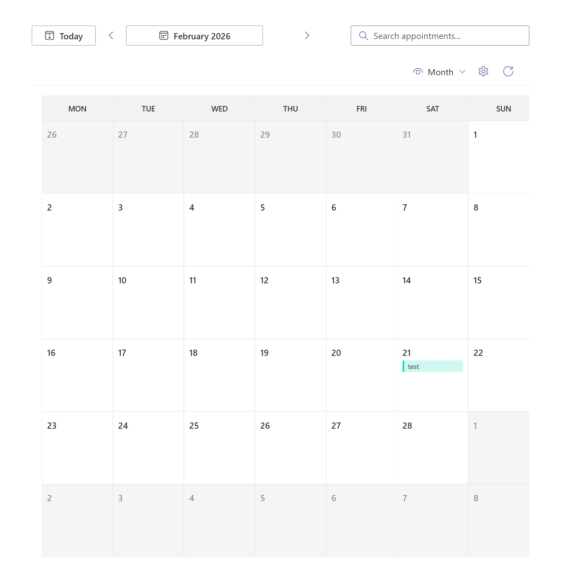

# <picture></picture> My Calendars

## Summary

A SharePoint Framework webpart that aggregates appointments from multiple calendar sources into unified, interactive calendar views. This solution integrates with Microsoft Exchange calendars, SharePoint lists, Microsoft Planner tasks, Microsoft 365 Group and Teams calendars, Teams Shifts, and ICS feeds, allowing users to visualize and manage events from diverse sources in a single interface. It supports multiple calendar views (day, week, month, schedule) with customizable work hours, time slot durations, and advanced filtering capabilities.

## Screenshot

## Video

> *Video demonstration placeholder - Add a video showing the calendar views, source management, and key features.*

## Features

The My Calendars webpart provides the following functionality:

- **Multi-Calendar View Support**: Display appointments in Day, Week, Month, Schedule, and Search views
- **Multiple Calendar Sources**: Aggregate calendars from Exchange, SharePoint lists, Microsoft Planner tasks, Microsoft 365 Groups, Teams, Teams Shifts, and internet calendar feeds (ICS)
- **Exchange Integration**: Add user's own calendars and shared mailboxes with color mapping from Outlook
- **SharePoint Lists**: Support for custom SharePoint list calendars with configurable field mapping
- **Microsoft Planner Integration**: View Planner tasks as calendar appointments with filtering options (assigned to me, show completed tasks)
- **M365 Groups & Teams Integration**: Add one or more Group/Team calendars in a single flow, apply one color to the selection, and edit each calendar color afterwards
- **Teams Shifts Integration**: View Shifts from joined Teams, including draft shifts (shown in italics)
- **Internet Calendars**: Add ICS feeds with built-in CORS proxy support and fallback mechanisms
- **Work Hours Configuration**: Set custom work day hours and time slot durations (15-60 minutes)
- **Calendar Customization**: Toggle weekends, configure first day of week, and customize display settings
- **Source Logo Display**: Toggle visibility of source logos (Outlook, SharePoint, Planner, Groups/Teams) per service type
- **Theme Support**: Light/dark theme awareness with organizational branding
- **Calendar Management**: Enable/disable individual sources without removing them
- **Search Functionality**: Search across all appointments from all sources
- **PnP Calendar Foundation**: Day/Week/Month rendering uses `@pnp/spfx-controls-react` Calendar (Search view remains custom), including required control localization, `patch-package` support, and optional PnP telemetry opt-out
- **Standard Event Contract**: Uses the PnP Calendar `IEvent` model as the canonical event format across all calendar sources
- **Timezone-Aware Event Retrieval**: Uses mailbox settings to align event time rendering with the user's mailbox timezone
- **Caching Strategy**: Includes local caching (for example user identity and mailbox settings in `userHelper.ts`) to reduce repeated Graph calls, with planned expansion to additional data paths
- **User Preferences**: Store personal settings (work hours, calendar states) in OneDrive App Folder
- **Localization Support**: English language with Dutch translations in progress

## Configuration

The webpart can be configured through the property pane with the following options:

### View Settings
- **Default View**: Select the initial calendar view (Day, Week, Month, or Schedule)
- **Show Weekends**: Toggle to display or hide Saturday and Sunday
- **Start Hour**: Configure work day start time (0-23 hours)
- **End Hour**: Configure work day end time (0-23 hours)
- **Slot Duration**: Set time block intervals (15, 30, 45, or 60 minutes)
- **First Day of Week**: Choose which day to start the week on (Sunday through Saturday)

### Calendar Sources
- **Add Calendar**: Add Exchange calendars, SharePoint list calendars, Microsoft Planner tasks, Microsoft 365 Group/Teams calendars, Teams Shifts, or internet calendar feeds
- **Manage Sources**: View, enable/disable, or remove calendar sources
- **Assign Colors**: Customize the color for each calendar source
- **Group/Teams Picker**: Start from either the **M365 Group** or **Teams** button (same destination), select one or more items, and apply one initial color to all selected calendars
- **Field Mapping**: Configure custom field mappings for SharePoint list calendars
- **Planner Filters**: Filter Planner tasks by assignment (assigned to me only) and completion status
- **Logo Display**: Toggle visibility of service logos per source type (Exchange, SharePoint, Planner, Groups/Teams, Teams Shifts)

### ICS Proxy Settings
- **Use Custom Proxy**: Enable a custom proxy for CORS-enabled ICS feeds
- **Custom Proxy URL**: Specify your custom proxy endpoint
- **Use whateverorigin.org**: Enable the free whateverorigin.org CORS proxy as a fallback
- **Proxy Priority**: Configure the order of proxy fallbacks

## Installation and Upgrades

### Download or compile
[Download the latest release](https://github.com/DwayneSelsig/spfx-my-calendars-webpart/releases) or compile the solution (`npm run build`). The `.sppkg` file will be in `sharepoint/solution/`.

### Installation
Go to the [SharePoint admin center → **More features**](https://go.microsoft.com/fwlink/?linkid=2185077) → **Apps** → **Open** → **Upload** the `.sppkg` file. Approve Microsoft Graph permissions (`Calendars.Read`, `Calendars.Read.Shared`, `MailboxSettings.Read`, `Files.ReadWrite.AppFolder`, `Sites.Read.All`, `Tasks.Read`, `Group.Read.All`, `Team.ReadBasic.All`, and `Schedule.Read.All`) when prompted.

### Upgrades
Upload the new `.sppkg` file and overwrite the existing one when prompted.

> **Note:** SharePoint add-ins are being retired, but SharePoint Framework (SPFx) solutions like this one are not affected and remain fully supported.

For more information, see the SharePoint App Catalog documentation:
https://learn.microsoft.com/sharepoint/use-app-catalog

## Contributing

We welcome contributions from the community! Here are some ways you can help:

- **Translations**: Help translate the webpart into additional languages. Dutch translations are currently in progress. If you'd like to contribute translations, please submit a pull request with the updated localization files in the `loc` folder.
- **Feature Suggestions**: Have an idea for a new feature or improvement? Please open an issue to share your suggestion. We'd love to hear about features you'd like to see in the My Calendars webpart, such as new calendar sources, view options, or advanced filtering capabilities.
- **Bug Reports**: Found a bug? Please open an issue with detailed steps to reproduce and your environment details.

## Solution

| Solution    | Author(s)                                               |
| ----------- | ------------------------------------------------------- |
| spfx-my-calendars-webpart | Dwayne Selsig |

## Version history

| Version | Date             | Comments        |
| ------- | ---------------- | --------------- |
| 0.0.1 | 2026-02-21       | Initial release |
| 0.0.2 | 2026-02-21       | Added Planner calendars |
| 0.0.3 | 2026-02-25       | Added Teams Shifts calendars |
| 0.0.4 | 2026-03-08       | Added Teams and Microsoft 365 Groups calendars |
| 0.0.5 | 2026-03-15       | Switched day/week/month rendering to PnP Calendar, standardized on `IEvent`, added mailbox timezone-aware event handling, and introduced cache-first user/mailbox lookups |
| 0.0.6 | 2026-03-24       | Improved search performance through debouncing, streamlined Property Pane behavior, and enhanced the settings panel |

## Used SharePoint Framework Version

## Applies to

- [SharePoint Framework](https://aka.ms/spfx)
- [Microsoft 365 tenant](https://docs.microsoft.com/sharepoint/dev/spfx/set-up-your-developer-tenant)

> Get your own free development tenant by subscribing to [Microsoft 365 developer program](http://aka.ms/o365devprogram)

## Prerequisites

Before getting started, ensure your development environment is properly set up by following the [SharePoint Framework development environment setup guide](https://learn.microsoft.com/en-us/sharepoint/dev/spfx/set-up-your-development-environment).

Additional requirements:
- Node.js version 22.14.0 or higher (and lower than 23.0.0)
- Appropriate Microsoft Graph permissions configured in your SharePoint tenant
- Access to a SharePoint site where the webpart can be deployed
- Configured calendar sources (Exchange, SharePoint lists, Microsoft 365 Groups/Teams, Planner, Teams Shifts, or internet calendars)

## Disclaimer

**THIS CODE IS PROVIDED _AS IS_ WITHOUT WARRANTY OF ANY KIND, EITHER EXPRESS OR IMPLIED, INCLUDING ANY IMPLIED WARRANTIES OF FITNESS FOR A PARTICULAR PURPOSE, MERCHANTABILITY, OR NON-INFRINGEMENT.**

---

## Minimal Path to Awesome

- Clone this repository
- Ensure that you are at the solution folder
- In the command-line run:
  - `npm install @rushstack/heft --global`
  - `npm install`
  - `heft start`

Other build commands can be listed using `heft --help`.

To build the solution for production:
- `npm run build`

## Microsoft Graph Permissions

This solution requires the following Microsoft Graph permissions:

- `Calendars.Read` - To read the current user's calendars
- `Calendars.Read.Shared` - To read calendars that have been shared with the user
- `MailboxSettings.Read` - To read mailbox timezone and other mailbox settings for correct event time conversion
- `Files.ReadWrite.AppFolder` - To store and retrieve user settings from OneDrive App Folder
- `Sites.Read.All` - To discover and read SharePoint list calendars
- `Tasks.Read` - To read Planner tasks from plans the user has access to
- `Group.Read.All` - To discover Microsoft 365 Groups and read Group/Team calendar events
- `Team.ReadBasic.All` - To discover joined Teams and dynamically map Group vs Teams icons
- `Schedule.Read.All` - To read Teams Shifts

`Calendars.Read` and `Calendars.Read.Shared` are covered by basic calendar access consent; `MailboxSettings.Read`, `Files.ReadWrite.AppFolder`, `Sites.Read.All`, `Tasks.Read`, `Group.Read.All`, `Team.ReadBasic.All`, and `Schedule.Read.All` must be approved by a tenant admin via the API access page.

## References

- [Getting started with SharePoint Framework](https://docs.microsoft.com/sharepoint/dev/spfx/set-up-your-developer-tenant)
- [Building for Microsoft Teams](https://docs.microsoft.com/sharepoint/dev/spfx/build-for-teams-overview)
- [Use Microsoft Graph in your solution](https://docs.microsoft.com/sharepoint/dev/spfx/web-parts/get-started/using-microsoft-graph-apis)
- [Microsoft Graph Calendar API](https://learn.microsoft.com/en-us/graph/api/resources/calendar?view=graph-rest-1.0)
- [Microsoft Graph Planner API](https://learn.microsoft.com/en-us/graph/api/resources/planner-overview?view=graph-rest-1.0)
- [PnP SPFx React Controls - Calendar](https://pnp.github.io/sp-dev-fx-controls-react/controls/Calendar/)
- [Publish SharePoint Framework applications to the Marketplace](https://docs.microsoft.com/sharepoint/dev/spfx/publish-to-marketplace-overview)
- [Microsoft 365 Patterns and Practices](https://aka.ms/m365pnp) - Guidance, tooling, samples and open-source controls for your Microsoft 365 development
- [Heft Documentation](https://heft.rushstack.io/)

Icon from [Microsoft Fluent UI System Icons](https://github.com/microsoft/fluentui-system-icons) (MIT License)
